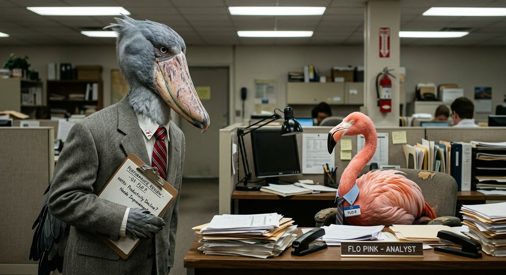

# shoebill.

A wall of funny shoebill stork images — [live wall](https://56eli.github.io/shoebill/) (deployed from `main` / `docs`).

Pure mosaic, infinitely scrollable — hover to pop, click to view full.



## quickstart

- **Site:** `docs/index.html` + `docs/style.css` + `docs/script.js` → GitHub Pages serves `main` / `docs` — **purely pictures, no chrome, mosaic infinitely scrollable**
- **Shown on wall:** `docs/funny/` (promoted funny) **+** `docs/placeholder/` (funny enough for now) — both listed in `docs/manifest.json` → one mosaic
- **Not shown:** `unfunny/` (repo root, archived) — never deployed
- Folders are **repo-only, not seen on the website** — site is only the mosaic.

Settings → Pages → Source: **Deploy from a branch** → Branch: `main` / `docs` → Save.

Local preview:

```bash
python -m http.server 8000 --directory docs
# open http://localhost:8000 — pure mosaic, gap 2px, no header/footer
# bind to 0.0.0.0 for Arena preview proxy
```

Adding images:

```bash
# new batch goes to placeholder (also shown) — both folders appear
# drop 10 into docs/placeholder or docs/funny
node scripts/sync-manifest.js  # reads both funny + placeholder
cp docs/placeholder/*.jpg placeholder/  # mirror root alias
cp docs/funny/*.jpg funny/
git add docs/funny docs/placeholder docs/manifest.json placeholder funny
git commit -m "feat: add 10 shoebills"
git push origin arena/019fe2c4-shoebill
```

## folders

```
docs/
  index.html        # pure mosaic wall (no chrome) + lightbox
  style.css         # mosaic grid, hover pop (scale 1.02)
  script.js         # loads manifest.json (funny+placeholder)
  manifest.json     # list of ALL wall images (funny then placeholder, sorted)
  funny/            # ✅ shown (promoted, confirmed funny — initial 10 are funny)
  placeholder/      # ✅ shown (funny enough for now, staged)
  .nojekyll
unfunny/            # ❌ never shown, not deployed (repo root only)
funny/              # alias/mirror of docs/funny at repo root
placeholder/        # alias/mirror of docs/placeholder at repo root
scripts/
  sync-manifest.js  # regenerate manifest from docs/funny + docs/placeholder
  sync-funny.sh     # keep root ↔ docs in sync
```

Wall shows **funny + placeholder**, hides `unfunny`; folders themselves are not UI on the site.

## for AI agents

Read `agent.md` first. TL;DR:

- **ALWAYS generate 10 images per prompt AND after every `ask_user` answer** without being asked, very creative & detailed
- **ONLY THE USER decides what’s funny** — you move `placeholder ↔ funny ↔ unfunny` on command, never delete
- **Mosaic is purely pictures**, infinitely scrollable, `gap:2px`; `funny` + `placeholder` both shown, `unfunny` never
- Use the **question tool** to ask “What next?” and provide a **one-sentence summary** on completion
- If explanation > few words, write a **temporary response file** (e.g., `RESPONSE.md`)
- **Push every 15 minutes** and on sub-task completion to `arena/…` branch
- Workflow changes require **manual GitHub web editor** full-file drop-in — avoid if possible

See `agent.md`, `AGENT.md`, `AGENTS.md`, `CONTRIBUTING.md`, `docs/README.md`.

## curation

- Initial 10 in `docs/funny/` are **confirmed funny** (per user).
- New batch (10) → `docs/placeholder/` (still shown as mosaic) → user reviews → promote to `docs/funny/` (stays shown, now confirmed) or demote to `unfunny/` (disappears, not deployed)
- After any move, `node scripts/sync-manifest.js` + push

## license

MIT — shoebills are prehistoric and public domain in spirit.
